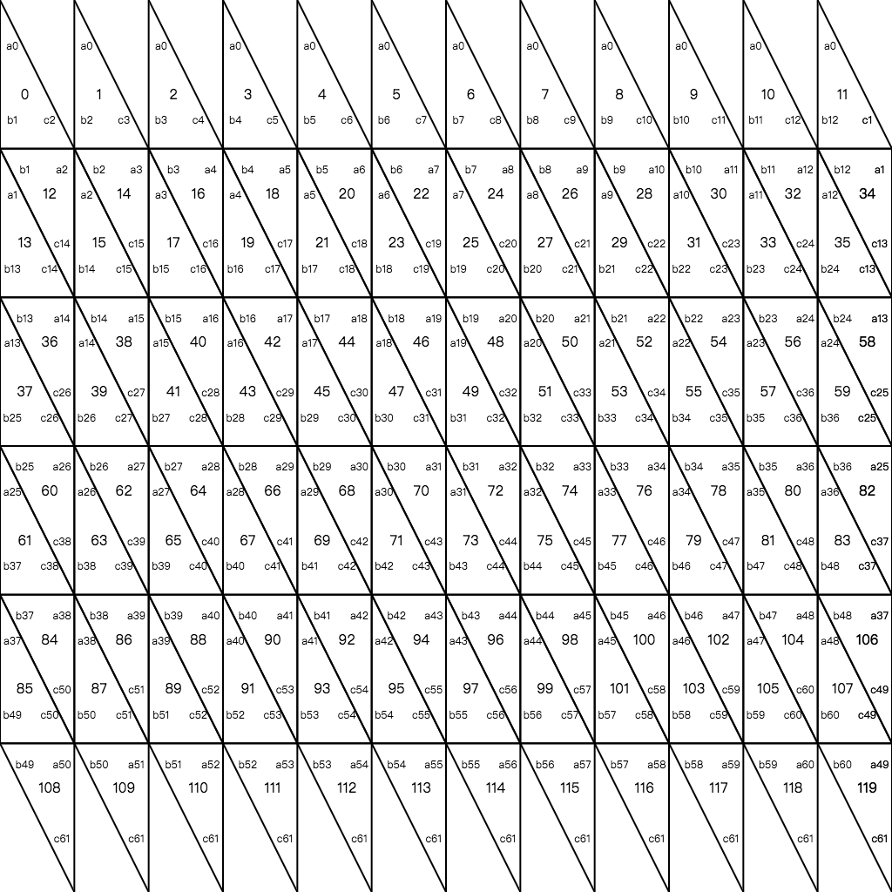
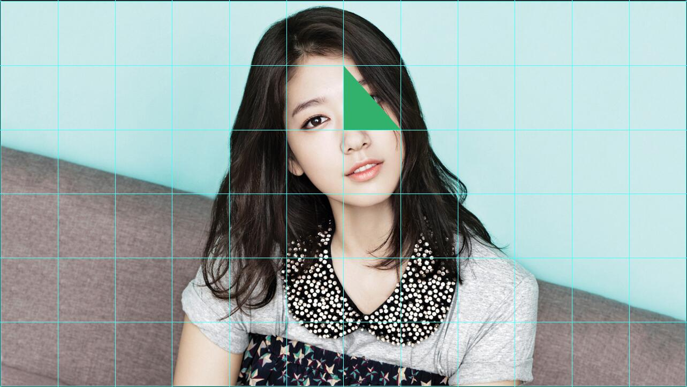
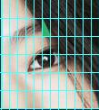
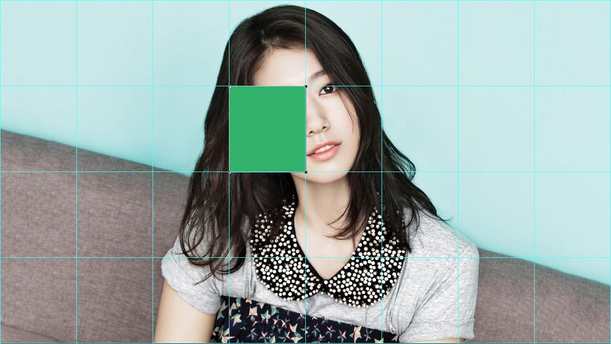

# 使用vr-panorama生成一个vr全景漫游系统(二)

## 前言

接着上一篇[使用vr-panorama生成一个vr全景漫游系统(一)]()，这篇文章我们主要介绍vr-panorama项目中动态加载切片图的实现。

将一张全景图贴在球面上我们可以很容易的实现，只要在球面上使用全景图作为纹理就可以了，但是一般来说，一张清晰的全景图尺寸都很大，如果直接显示整个贴到球面上，用户可能会等待很长一段时间才能看到渲染效果，对于用户来说体验很不友好，所以我们需要实现全景图的按需加载，我们首先将全景图压缩到一个体积比较小的尺寸，然后先渲染到球面上，然后当用户拖动全景图的时候我们通过计算得到应该渲染的碎片图，然后把这些清晰的碎片图加载到页面上。

为了实现这个功能，我们需要思考以下几个问题：

- 如何在球面上渲染多张纹理图片
- 如何将碎片图渲染到它应该出现的位置上
- 如何判断当前视野内应该加载哪些碎片图

## 如何在球面上渲染多张全景图

首先我们介绍一下三角面的概念，在threejs模型中，无论是正方体还是球体或者多面体，组成他们基本的单位都是三角形，正方体中，每一个面都是由两个三角形组合完成的，在球体中，同样也是通过一个个三角形组合完成的。我们就称这每一个三角形为三角面，在官方文档中，我们可以直观的看到每一个三角面。以球体为例，我们使用three生成球体对象的时候，需要制定横向切割数和纵向切割数，当我们的横向切割和纵向切割的值越大，生成的三角面也就越多，所生成的`球体`也就越像一个真正的球体。当我们使用纹理贴图的时候，实际上是把图片纹理渲染到每一个三角面上，然后组合成了完成的图片。

所以，想要在球面上渲染多张全景图，我们就需要让每一个三角面使用不同的图片作为渲染源。

首先，我们把要渲染的碎片图添加到materials数组中：

```js
// glPainter.js
// 加载清晰图
  loadSlices() {
    // 判断如果全部的碎片图都加载过一次就不再加载
    if(this.complate) return;
    const urls = this.slices;
    const camera = this.viewer.camera;
    if(!urls) return;
    const row = urls.length;
    const col = urls[0].length;
    // 渲染
    for(let i = 0; i < row; i++) {
      for(let j = 0; j < col; j++) {
        const index = i * col + j + 1;
          if(!this.sliceMap[`${i}-${j}`]) {
            const isInSight = utils.isInSight(i, j, camera);
            if(isInSight) {
              this.drawSlice(index, urls[i][j]);
              this.sliceMap[`${i}-${j}`] = 1;
              this.complate = this.checkComplate();
            }
          }
      }
    }
  }
```

这里我们通过读取数据中的slices数组，然后判断碎片图是否在当前视野(这个判断函数我们后面再详细说)，如果在的话我们就去加载这个图片，并添加到materials数组中：

```js
// glpainter.js
  // 设置材料数组
  drawSlice(index, url) {
    let loader = new TextureLoader();
    loader.format = RGBFormat;
    loader.crossOrigin = '*';
    // 使用全景图片生成纹理
    loader.load(url, (texture) => {
      // 这里可以让纹理之间的过渡更加自然，不会出现明显的棱角
      texture.minFilter=LinearFilter;
      texture.magFilter=LinearFilter;
      this.sphere.material[index] = new MeshBasicMaterial({
        map: texture
      });
      this.updateSliceView(index);
    });
  }
```

现在我们要做的就是指定每一个三角面使用它对应的材料作为纹理：

```js
  // 更新三角面uv映射
  updateSliceView(index) {
    let sliceIndex = 0;
    const {widthSegments, heightSegments, widthScale, heightScale} = this;
    for (let i = 0, l = this.sphere.geometry.faces.length; i < l; i++) {
      // 每一个三角面对应的图片索引
      const imgIndex = utils.transIndex(i, widthSegments, heightSegments, widthScale, heightScale);
      if(imgIndex === index) {
        sliceIndex++;
        const uvs = utils.getVertexUvs(sliceIndex, widthScale, heightScale);
        if(i >= widthSegments*2*heightSegments - 3*widthSegments || i < widthSegments) {
          this.sphere.geometry.faces[i].materialIndex = index;
          this.sphere.geometry.faceVertexUvs[0][i][0].set(...uvs[0].a);
          this.sphere.geometry.faceVertexUvs[0][i][1].set(...uvs[0].b);
          this.sphere.geometry.faceVertexUvs[0][i][2].set(...uvs[0].c);
        }else {
          this.sphere.geometry.faces[i].materialIndex = index;
          this.sphere.geometry.faces[i+1].materialIndex = index;
          this.sphere.geometry.faceVertexUvs[0][i][0].set(...uvs[0].a);
          this.sphere.geometry.faceVertexUvs[0][i][1].set(...uvs[0].b);
          this.sphere.geometry.faceVertexUvs[0][i][2].set(...uvs[0].c);
          this.sphere.geometry.faceVertexUvs[0][i+1][0].set(...uvs[1].a);
          this.sphere.geometry.faceVertexUvs[0][i+1][1].set(...uvs[1].b);
          this.sphere.geometry.faceVertexUvs[0][i+1][2].set(...uvs[1].c);
          i++;
        }
      }
    }
  }
```

每一个三角面有一个materialIndex属性，它会自动读取materials对象中的指定index作为当前三角面的渲染源。

这里大家可能会有一个疑问，我们的球面被横向切成了很多份，纵向也被切割成了很多份，而我们的全景图碎片是按照8*4切割的，所以我们的materials数组最多也就32张图片，怎么知道每一个三角面应该使用哪张图片作为当前三角面的material呢？

其实这个是可以通过计算来得到的，我写了一个transIndex函数来完成这个计算，在看这个函数之前我们先看一张图：


这是一个横向切割数为12，纵向切割数为6的球体的三角面构成。它的三角面总数为120，其中顶部和底部的三角面数量是12，中间的每一行三角面数量是24。然后我们再来看这个函数，应该能更好理解：

```js
 /**
  * @description 这个函数用来计算球体每个三角面对应使用哪一张图片作为纹理
  * 全景图被分成 4*8 张图片 也就是4行8列
  * 球体的三角面数量为 横向分割数*2 + (纵向分割数-2)*横向分割数*2
  * 如果球体的纵向分割和横向分割正好是4和8，那么顶部和底部的每个三角面对应一张图片，中间每两个相邻的三角面共用一张图片
  * 球体的纵向分割和横向分割大于4和8，那么必须是4和8的整数倍，这样每个三角面和他左右的三角面和上下的三角面共用一张图片
  * @param {any} i 三角面的索引（第几个三角面）
  * @param {any} widthSegments 球体横向切割数
  * @param {any} heightSegments 球体纵向切割数
  * @param {any} widthScale 球体横向切割数/全景图的横向切割数
  * @param {any} heightScale 球体纵向切割数/全景图的纵向切割数
  * @returns imgIndex 图片索引
  */
 transIndex(i, widthSegments, heightSegments, widthScale, heightScale) {
    let row, col, imgIndex;
    // 第一行
    if(i < widthSegments) {
      row = 1;
      col = i+1;
    }else if(i < 3*widthSegments) {
      // 第二行
      row = parseInt((i+widthSegments)/(2*widthSegments)) + 1;
      col = parseInt((i - (row-1)*widthSegments)/2) + 1;
    }else if(i < widthSegments+2*widthSegments*(heightSegments-2)) {
      row = parseInt((i-widthSegments)/(2*widthSegments)) + 2;
      col = parseInt((i - (row-2) * 2 * widthSegments -widthSegments )/2) + 1;
    }else {
      // 最后一行
      row = parseInt((i-widthSegments)/(2*widthSegments)) + 2;
      col = parseInt( i - (row-2) * 2*widthSegments -widthSegments ) + 1;
    }
    row = Math.ceil(row/heightScale);
    col = Math.ceil(col/widthScale);
    imgIndex = (col-1) * 4 + row;
    return imgIndex;
  }
```

## 如何将碎片图渲染到它应该出现的位置上

现在，我们已经能够为每一个三角面指定不同的材料了，但是这个时候你会发现它们组合起来的图形并没有像我们的预想那样。这里涉及到threejs中uv映射的概念。

关于uv映射，这里推荐[一篇文章](http://www.techbrood.com/zh/news/webgl/%E6%B7%B1%E5%85%A5%E7%90%86%E8%A7%A3three_js%E7%BA%B9%E7%90%86%E8%B4%B4%E5%9B%BE%E5%92%8Cuv%E6%98%A0%E5%B0%84.html])，这篇文章里介绍了立方体贴图中uv映射的实现方式。其实，所以当我们将一整张图片贴到球面的时候，threejs已经为我们计算好了每一个三角面uv映射的值，让每一个三角面只渲染图片的某一部分，然后这些三角面组合在一起，就生成了完整的图片。

所以，我们虽然改变了每一个三角面所使用的渲染材料，但是我们并没有改变它们的uv映射坐标。文字描述可能不够直观，我们以上面的球面三角面为例，我们来看索引为61的三角面，它的uv映射坐标为[(6/12, 2/6), (7/12, 2/6), (6/12, 1/6)],它负责渲染下图的绿色区域:



根据transIndex函数，我们计算出它应该加载的碎片图是这张：


这时候根据原来的uv映射坐标，它渲染的就是下图中绿色区域：



所以，看到问题出在哪里了吧，现在我们要做的就是重新计算出每一个三角面的uv坐标，上面这种情况是最简单的一种情况：我们把球体的横纵向切割数和我们的全景图片的横纵向切割数设成一样，这个时候，对于顶部和底部，每一个三角面对应每一个碎片图，中间的部分每两个三角面共用一个碎片图，他们的uv坐标我们可以很容易计算出，但是这样会带来一个问题，顶部和底部由于只能利用碎片图的一半，必然会出现图片信息的丢失，为了让丢失的信息尽可能少，我们需要将图片切割成很多份，我个人测试，当横向和纵向切割数都>=64的时候，丢失的信息接近于0，这时候我们需要切割出64*64张碎片图，显然是不合理的，所以正常情况下，我们会有多行，多列三角面共用一张碎片图，我们要做的就是计算出对于这一张碎片图，每一个三角面的uv坐标，下面是我写的getVertexUvs函数(当时写的时候可能只有我和上帝知道这段代码是什么意思，现在来看，估计只有上帝知道了😂)：

```js
 /**
  * @description 这个函数用来计算当前三角面和他下一个三角面的uv映射坐标（两个相邻的三角面拼成一个矩形）
  * 比如说当前全景图是4*8 4行8列，但是球体被分割成8*16
  * 所以某一张分割图要被当前行4个三角面使用上半部分，被下一行的4个三角面使用下半部分(第一行和最后一行除外)
  * 第一行的话就是2个三角面使用上半部分，下一行的4个三角面使用下半部分
  * 最后一行的话就是上一行的4个三角面使用上半部分，当前行的2个三角面使用下半部分
  * 所以第一行和最后一行会有缺失
  * @param {any} index 第几个使用当前图形作为纹理的三角面
  * @param {any} widthScale 球体横向分割/全景图横向切割
  * @param {any} heightScale 球体纵向切割/全景图纵向切割
  * @returns 两个三角面的uv映射坐标
  */
 getVertexUvs(index, widthScale, heightScale) {
    // 两个三角面组成的矩形的四个顶点坐标
    const vectors = [
      [((index-1)%widthScale + 1)/widthScale, 1- (parseInt((index-1)/widthScale)%heightScale)/heightScale],
      [((index-1)%widthScale)/widthScale, 1- (parseInt((index-1)/widthScale)%heightScale)/heightScale],
      [((index-1)%widthScale)/widthScale, 1- (parseInt((index-1)/widthScale)%heightScale + 1)/heightScale],
      [((index-1)%widthScale + 1)/widthScale, 1- (parseInt((index-1)/widthScale)%heightScale + 1)/heightScale]
    ];
    return [
      {
        a: vectors[0],
        b: vectors[1],
        c: vectors[3]
      },
      {
        a: vectors[1],
        b: vectors[2],
        c: vectors[3]
      }
    ];
  }
```

有兴趣的同学可以研究一下这里的逻辑，这里不再过多介绍。

## 如何判断当前视野内应该加载哪些碎片图

最后回到一开始的isInSight函数，我们通过这个函数来判断当前视野应该加载哪张碎片图。先说一下实现的大概思路：

首先我们需要知道当前视野内有哪几张碎片图，还记得我们上一篇文章中介绍的视锥体吗？既然这里和我们的视野有关，当然离不开视锥体了，我们可以把问题转换为哪些碎片图与当前视锥体相交，如果相交，那么这张碎片图就在视野中。

如何判断一个碎片图是否和视锥体相交呢？我们知道，每一张碎片图都有自己的2d坐标，当它被渲染到球面上的时候，也有自己的3d坐标，从2d坐标转换到3d坐标，有没有让你想起经纬度呢？还是拿这张图片为例：



图中绿色的碎片图的2d坐标是[(3/8, 1/4), (4/8, 1/4), (4/8, 1/2), (3/8, 1/2)]，渲染到球面上它的经度就是每个点x乘2π，纬度就是每个点的y坐标乘π，通过球体的顶点计算公式，我们计算出这个碎片图的四个点的坐标，然后生成一个包围球，判断包围球与视锥体是否相交。

下面是完整实现：

```js
 /**
  * @description 这个函数用来判断一张切图是不是在当前视线中
  * 球体顶点计算公式 x: r*sinθ*cosφ y: r*cosθ z: r*sinθ*sinφ θ纬度 φ经度
  * 行 => 纬度  列 => 经度
  * 全景图一共4行8列 那么某一张图片对应到球面上的顶点坐标就可以求出来
  * 然后根据这4个顶点创建一个几何图形，判断这个几何图形的包围球是否与相机的视锥体相交
  * @param {any} row 当前切图的行
  * @param {any} col 当前切图的列
  * @param {any} camera 判断相交的相机
  * @returns 是否在当前视线
  */
 isInSight(row, col, camera) {
    // 球体半径
    const Radius = 10;
    // 经度 2π 分成8份， 每份是4/π
    // 维度 π 分成4份， 每份也是4/π
    const ltPoint = {
      x: Radius*Math.sin(col * Math.PI / 4) * Math.cos(row * Math.PI / 4),
      y: Radius*Math.cos(col * Math.PI / 4),
      z: Radius*Math.sin(col * Math.PI / 4) * Math.sin(row * Math.PI / 4)
    };
    const rtPoint = {
      x: Radius*Math.sin(col * Math.PI / 4) * Math.cos((row+1) * Math.PI / 4),
      y: Radius*Math.cos(col * Math.PI / 4),
      z: Radius*Math.sin(col * Math.PI / 4) * Math.sin((row+1) * Math.PI / 4)
    };
    const lbPoint = {
      x: Radius*Math.sin((col+1) * Math.PI / 4) * Math.cos(row * Math.PI / 4),
      y: Radius*Math.cos((col+1) * Math.PI / 4),
      z: Radius*Math.sin((col+1) * Math.PI / 4) * Math.sin(row * Math.PI / 4)
    };
    const rbPoint = {
      x: Radius*Math.sin((col+1) * Math.PI / 4) * Math.cos((row+1) * Math.PI / 4),
      y: Radius*Math.cos((col+1) * Math.PI / 4),
      z: Radius*Math.sin((col+1) * Math.PI / 4) * Math.sin((row+1) * Math.PI / 4)
    };

    // 创建一个几何图形，四个顶点分别为贴图的四个顶点坐标、
    const geometry = new Geometry();
    geometry.vertices.push(
        new Vector3( ltPoint.x, ltPoint.y, ltPoint.z ),
        new Vector3( rtPoint.x, rtPoint.y, rtPoint.z ),
        new Vector3( lbPoint.x, lbPoint.y, lbPoint.z ),
        new Vector3( rbPoint.x, rbPoint.y, rbPoint.z ),
    );
    geometry.faces.push( new Face3( 0, 1, 2 ), new Face3( 1, 2, 3 ) );

    // 然后判断包围球是否与视锥体相交
    const tagMesh = new Mesh(geometry);
    const off = this.isOffScreen(tagMesh, camera);
    return !off;
  }
```

## 最后

至此，我们就实现了全景图的按需加载，项目中剩下的vr眼镜模式，除css3d的兼容实现，基本上是使用threejs的相关插件完成的，就不再详细介绍了，有兴趣的同学可以去[项目地址](https://github.com/fightingm/vrpano)中查看，有问题欢迎交流，如果该项目对你有帮助，别忘了给个star哦，感谢阅读。